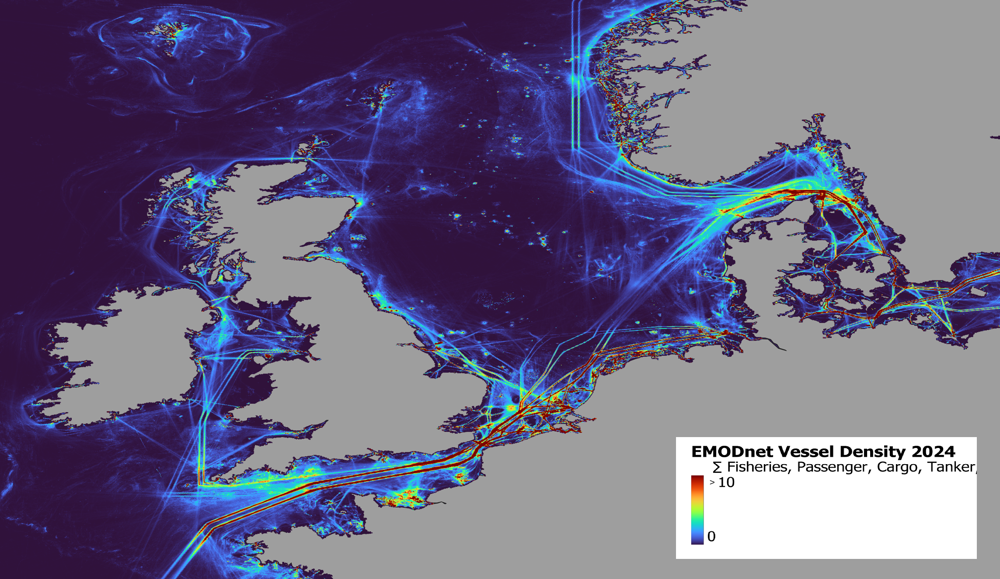

NaviSafe (SHOM) is a **MSP tool** which provides a **macroscopic view on potential maritime traffic risks** with different activities and sea uses. The tool is currently under development.

The risk calculation is vased on a risk matrix per vesel type and activity, which was developed based on expert judgement and literature review.

**Step 1**: Collision Risk calculation was performed per vessel type with the ReMAP NaviSafe Tool. Risk Index output ranges from 0 (low risk) to 4 (high risk).

**Step 2**: Vessel type risk maps were summed to a Cumulative Risk Index to showcase the cumulative collision risk for all vessel types with OWF.

```{=html}
<div class="content-images-scroll" style="--content-image-height:500px;">
  <div class="content-images-row">
    
    
  </div>
</div>
```
