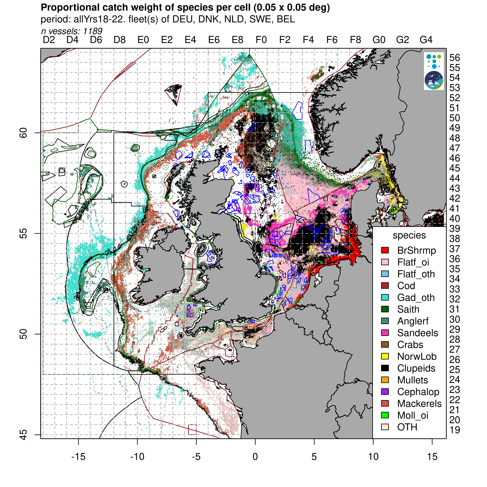
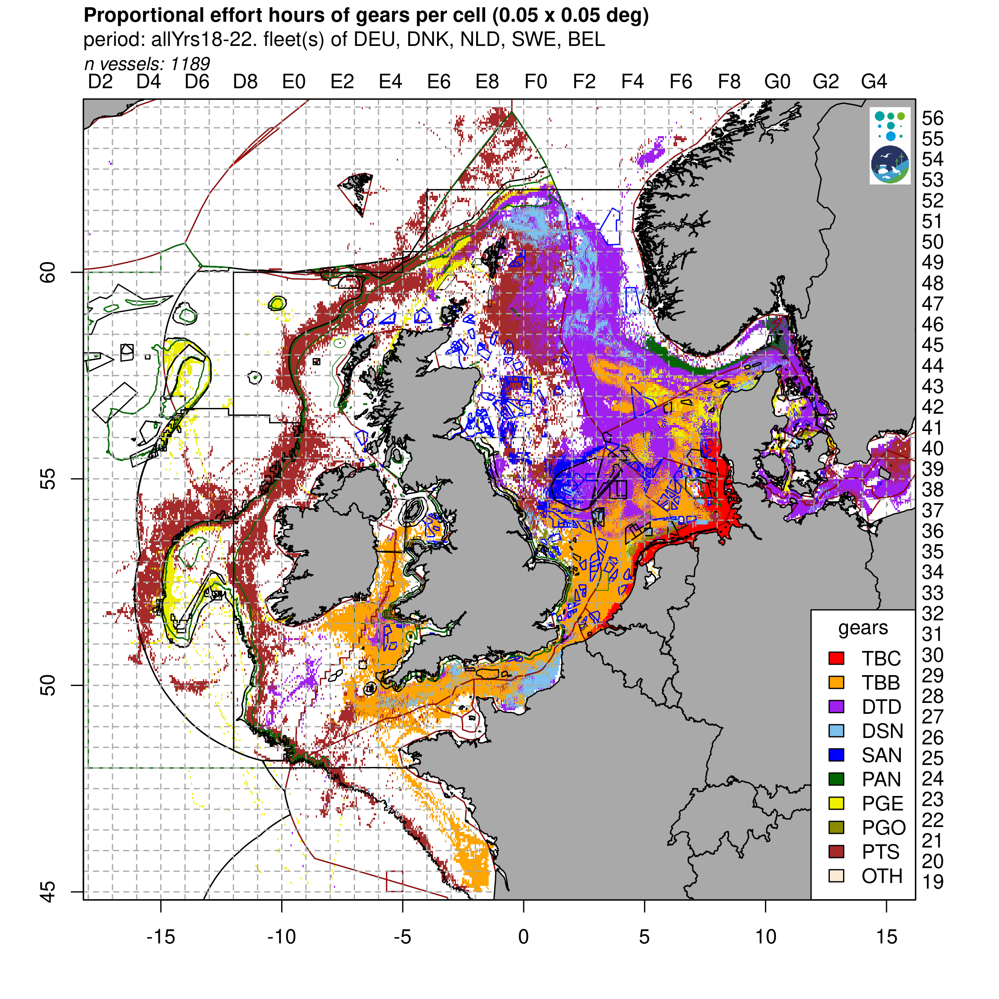

Proportional catch weight and fishing effort for fleets from Germany, Denmark, Netherlands, Sweden and Belgium (2018-2022).

```{=html}
<div class="content-images-scroll" style="--content-image-width:600px;">
  <div class="content-images-row">
    
    
  </div>
</div>
```

::: {layout="[ [1] ]"}

```{=html}
<iframe style="border:none;" height="800" width="100%" src="https://viewer.openearth.nl/compendium-greater-north-sea-embedded/?folders=KjTZRqc8QQKQdsP6MHInmg&layers=RuPfKLDBR32hx3hqYhyZkw&layerNames=Bottom%20Fishing%20Intensity%20,%20Subsurface%20%28OSPAR,%202020%29"></iframe>
```

:::
